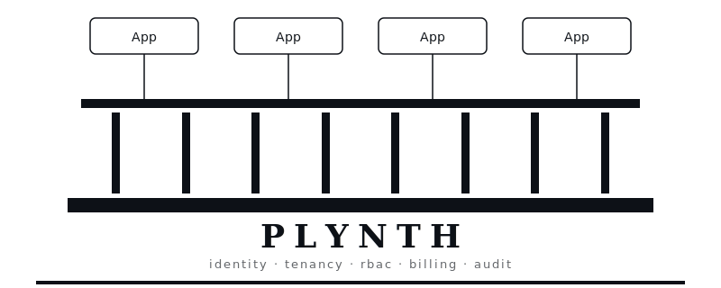
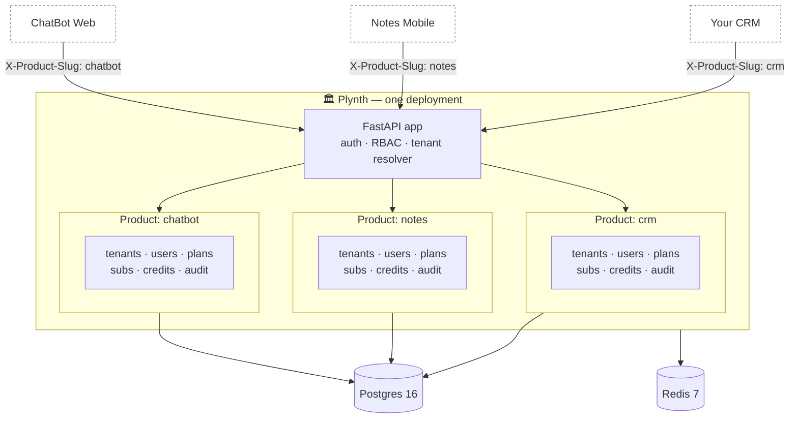

<h1 align="center">🏛️ Plynth</h1>

<p align="center"><strong>Stop rebuilding the same SaaS plumbing.</strong></p>

<p align="center">
  <picture>
    <source media="(prefers-color-scheme: dark)" srcset="docs/assets/banner-dark.svg">
    
  </picture>
</p>

<p align="center">
A reusable, batteries-included backend for SaaS founders — identity, multi-tenancy, RBAC, plans, subscriptions, billing, credits, audit, jobs — packaged so <strong>one deployment hosts many independent products</strong>. Fork it, drop your product code in, ship in a week instead of six months.
</p>

<p align="center"><em>One foundation. Many products. Drop yours in.</em></p>

<p align="center">
  <a href="https://github.com/shubhamkatta/plynth/actions/workflows/ci.yml"></a>
  <a href="https://codecov.io/gh/shubhamkatta/plynth"></a>
  <a href="https://github.com/shubhamkatta/plynth/blob/main/LICENSE"></a>
  
  <a href="https://github.com/shubhamkatta/plynth/blob/main/CONTRIBUTING.md"></a>
  <a href="https://github.com/shubhamkatta/plynth/releases"></a>
  <a href="https://shubhamkatta.github.io/plynth/"></a>
</p>

<!-- ALL-CONTRIBUTORS-LIST:START - Do not remove or modify this section -->
<!-- prettier-ignore-start -->
<!-- markdownlint-disable -->
<!-- ALL-CONTRIBUTORS-LIST:END -->

<details>
<summary><strong>📖 Contents</strong></summary>

- [Why Plynth?](#why-plynth)
- [How it works](#how-it-works)
- [Features](#features)
- [Compared to alternatives](#compared-to-alternatives)
- [Stack](#stack)
- [Quickstart (5 minutes)](#quickstart-5-minutes)
- [The Electron admin (optional)](#the-electron-admin-optional)
- [Architecture](#architecture)
- [What's intentionally NOT in the scaffold](#whats-intentionally-not-in-the-scaffold)
- [Contributing](#contributing)
- [License](#license)
- [Docs index](#docs-index)

</details>

---

## Why Plynth?

Every founder building a B2B or B2C SaaS rebuilds the same plumbing before they
write a single line of product code: sign-up and sign-in, password reset,
OAuth, multi-tenancy with strict isolation, RBAC, plans and subscriptions, a
billing state machine, metered credits, audit log, background jobs, deploy.
That is six months of work — most of it boring, all of it security-critical.

Plynth ships that 80% as a reusable backend layer. Identity, tenancy, RBAC,
billing, credits, audit, jobs, observability — wired together, tested, and
designed to host **many independent SaaS products on one deployment**. Each
product gets its own tenants, users, plans, subscriptions, and credits, fully
isolated end-to-end. The same email or company can sign up in two products
without conflict.

Most scaffolds assume one product per deployment. Plynth keys every domain
table on `(product_id, tenant_id)` so you can run an internal tool, a B2C app,
and a B2B platform on one Postgres + one worker pool with zero cross-bleed. Add
a new product with one admin call. Fork it, drop your product code under
`app/products/<name>/`, and ship in a week instead of six months.

## How it works

One deployment hosts many products. Every domain table (users, tenants, plans, subscriptions, credits, audit) keys off `(product_id, tenant_id)`, so isolation is enforced at the repository layer — there is no path through the API that crosses a product boundary without an explicit `bypass_product()` block (reviewed line by line).



The same FastAPI process handles every product. Tenant + product context is set per-request from the `X-Product-Slug` header (public routes) or the `pid` JWT claim (authenticated routes); the two must agree. Adding a new product is one admin call — no infrastructure work, no schema change, no new deployment.

## Features

### Multi-product, multi-tenant core
- **Multi-product** — bootstrap a new product via one admin call; all scoped
  APIs key off the `X-Product-Slug` header (public) or the JWT `pid` claim
  (authenticated). Header and claim must agree.
- **Multi-tenancy** — strict dual `(product_id, tenant_id)` isolation enforced
  at the repository layer, parent → child tenants with role-gated act-as, B2B
  and B2C in the same model (`Tenant.type`).
- **RBAC + IAM** — `resource:action` permissions from a global catalogue,
  per-product system and custom roles, role bindings scoped to a child tenant.

### Identity
- Email + password sign-up and sign-in, JWT access + refresh with server-side
  revocation, Argon2id hashing.
- Forgot-password and reset (single-use token), password change, `/me`.
- Google OAuth2 login with per-product auto-provisioning toggle.

### Billing and metering
- **Plans and subscriptions** — plan catalogue per product; lifecycle is
  `trial → active → past_due → grace → suspended → cancelled` with an
  upgrade/downgrade proration hook.
- **Billing** — provider-agnostic interface; Stripe driver in tree, mock
  driver for local dev. Idempotency-Key honoured on every mutating endpoint.
- **Credits / metered usage** — append-only ledger per tenant, plan-driven
  monthly allotments, atomic consumption via `SELECT … FOR UPDATE` with
  caller-supplied `reference` for retry-safe dedupe.

### Operations
- **Lifecycle ops** — invite, activate, deactivate, soft-delete (re-invite of
  the same email after delete is supported via partial unique indexes), audit
  log of every state change including `acting_from_tenant_id` for act-as
  traffic.
- **Per-product config** — refresh-token TTL, Google auto-provisioning,
  parent → child act-as, and more are JSONB `settings` on `Product`.
- **Background jobs** — arq workers for payment reminders, grace-period
  transitions, and credit resets.
- **Observability** — structlog JSON on stdout; `request_id`, `product_id`,
  `tenant_id`, `user_id` propagated through every log. `/health` and `/ready`
  for orchestrators.
- **Platform admin token** — true super-user across all routes for ops and
  support workflows.

### Hardened by default
- `/docs` and `/openapi.json` hidden in prod.
- Partial unique indexes so soft-deleted rows free their slug / email.
- `Tenant.expires_at` hard-cap enforcement.
- No bare `except Exception`; typed `AppError` hierarchy with central handlers.

### Reference Electron admin
- Desktop admin app at `apps/admin-electron/` manages every product, tenant,
  user, plan, subscription, credit wallet, and audit row from one window.
- `contextIsolation: true`, `nodeIntegration: false`, `sandbox: true`, strict
  CSP, tokens in keytar — never `localStorage`.

### Developer experience
- Dockerised. `make up`, `make migrate`, `make seed`, `make test`.
- Autoreload, ruff, mypy, pytest. 170+ tests, runs in ~17s on Postgres.
- Claude Code skills under `.claude/skills/` for extending the platform.

## Compared to alternatives

How Plynth stacks up against the common ways people approach this problem. Honest assessment — every alternative shines somewhere; pick what fits your shape.

|                                            | **Plynth** | DIY (FastAPI / Express) | Supabase | Nhost  | PocketBase |
| ------------------------------------------ | :--------: | :---------------------: | :------: | :----: | :--------: |
| Many independent products on one deploy    |     ✅     |           🔨            |    ❌    |   ❌   |     ❌     |
| Self-host (one Docker Compose)             |     ✅     |           ✅            | ⚠️ heavy |  ⚠️    |     ✅     |
| Strict `(product, tenant)` isolation in the ORM | ✅    |           🔨            | ⚠️ RLS-only |  ⚠️ |     ❌     |
| RBAC + custom roles out of the box         |     ✅     |           🔨            | ⚠️ basic | ⚠️ basic |    ❌     |
| Plans + subscription state machine         |     ✅     |           🔨            |    ❌    |  ⚠️    |     ❌     |
| Metered credits + append-only ledger       |     ✅     |           🔨            |    ❌    |   ❌   |     ❌     |
| Audit log of every mutation                |     ✅     |           🔨            |   ⚠️    |   ❌   |     ❌     |
| Bring-your-own-frontend (backend only)     |     ✅     |           ✅            | ❌ opinionated | ❌ |   ⚠️     |
| No vendor lock-in (own your Postgres)      |     ✅     |           ✅            | ⚠️ Postgres-on-Supabase | ❌ | ✅ |
| Python-native (FastAPI + SQLAlchemy)       |     ✅     |           ✅            |   ❌ TS  |  ❌ TS |   ❌ Go    |
| Reference desktop admin included           |     ✅     |           ❌            |   ❌    |   ❌   |    ⚠️ web |

Legend: ✅ shipped · ⚠️ partial or opinionated · ❌ not supported · 🔨 you build it

**The honest summary:** if you're building one product and want a hosted backend, Supabase or Nhost is faster. If you're shipping multiple SaaS products on shared infra, want full ownership of identity + billing + audit, and prefer Python, that's where Plynth wins.

## Stack

| Concern | Choice | Why |
| --- | --- | --- |
| Web framework | FastAPI | async, OpenAPI baked in, fast |
| ORM | SQLAlchemy 2.0 (async) + asyncpg | mature, async, typed |
| Database | PostgreSQL 16 | JSONB, partial indexes, optional RLS |
| Cache / queue | Redis 7 | arq, rate-limit, idempotency, slug cache |
| Background jobs | arq | Redis-native, ~10× lighter than Celery |
| Migrations | Alembic | the standard |
| Auth | PyJWT + Argon2id (argon2-cffi) | OWASP-recommended |
| Validation | Pydantic v2 | fastest pure-Python validator |
| Billing | Stripe (pluggable) | provider interface in `app/providers/billing` |
| Admin client | Electron 32 + React 18 + Mantine 7 + TanStack Query | drop-in desktop admin |
| Container | python:3.12-slim multi-stage | ~120 MB runtime image |

## Quickstart (5 minutes)

```bash
git clone https://github.com/shubhamkatta/plynth.git
cd plynth
cp .env.example .env
make up                  # postgres + redis + api + worker
make migrate             # apply schema (Alembic + scripts/migrate.py)
make seed                # default product "platform" + standard plans + admin user
open http://localhost:8000/docs
```

> **Default seeded admin (change immediately):**
> `admin@example.com` / `ChangeMeNow123!`
> Default product slug: `platform`. Send `X-Product-Slug: platform` on every
> public API call (login, register, plan listing); authenticated calls derive
> the product from the JWT.

### Bootstrap a new product

```bash
curl -X POST http://localhost:8000/api/v1/admin/products \
  -H "X-Platform-Admin-Token: $PLATFORM_ADMIN_TOKEN" \
  -H "Content-Type: application/json" \
  -d '{"name": "ChatBot", "slug": "chatbot"}'

# now register a tenant inside it
curl -X POST http://localhost:8000/api/v1/auth/register \
  -H "X-Product-Slug: chatbot" \
  -H "Content-Type: application/json" \
  -d '{"tenant_name": "Acme", "tenant_slug": "acme",
       "email": "owner@acme.example.com", "password": "S3cretPassword!"}'
```

The admin endpoint seeds system roles automatically. Create plans for the new
product via the plans endpoint — see [`docs/multi-product.md`](docs/multi-product.md).

### B2C signup (one user, no company)

```bash
curl -X POST http://localhost:8000/api/v1/auth/register-individual \
  -H "X-Product-Slug: notepad" \
  -H "Content-Type: application/json" \
  -d '{"email": "alice@example.com", "password": "S3cretPassword!",
       "full_name": "Alice Rivers"}'
```

Underneath it is the same `register` flow — same trial subscription, credits,
audit. See [`docs/multi-tenancy.md`](docs/multi-tenancy.md) § "B2B vs B2C".

## The Electron admin (optional)

`apps/admin-electron/` is a reference desktop client built on Electron 32 +
React 18 + Mantine 7 + TanStack Query. It consumes only the documented REST
API — no privileged surface — and manages products, tenants, users, plans,
subscriptions, credits, and audit for every product on the deployment from one
window. Default API base is `http://localhost:8000`. See
[`apps/admin-electron/README.md`](apps/admin-electron/README.md).

## Client SDKs

Two first-party SDKs live in `sdks/` for products that integrate against the
platform. Both implement the same auth flow, `Idempotency-Key` semantics,
refresh-on-401, and `{code, message, details}` error envelope as the manual
contract in [`docs/INTEGRATION.md`](docs/INTEGRATION.md).

| SDK | Package | Path | Runtime deps |
| --- | --- | --- | --- |
| TypeScript / JS | `@plynth/sdk` | [`sdks/typescript/`](sdks/typescript/) | none (native `fetch`) — Node 20+, browsers, Edge, Workers |
| Python | `plynth-sdk` | [`sdks/python/`](sdks/python/) | `httpx` only — sync + async clients |

```ts
import { PlynthClient } from "@plynth/sdk";
const c = new PlynthClient({ baseUrl: "...", productSlug: "chatbot" });
await c.auth.login({ email, password });
const me = await c.auth.me();
```

```python
from plynth_sdk import PlynthClient
with PlynthClient(base_url="...", product_slug="chatbot") as c:
    c.auth.login({"email": email, "password": password})
    me = c.auth.me()
```

Token storage is pluggable (`MemoryStore` by default; opt-in `LocalStorageStore`
/ `FileStore`; bring your own). See
[`sdks/typescript/README.md`](sdks/typescript/README.md) and
[`sdks/python/README.md`](sdks/python/README.md) for resource maps and auth
modes. A Next.js example wiring the TS SDK to HttpOnly cookies lives at
[`examples/nextjs-starter/`](examples/nextjs-starter/).

## Architecture

Layers flow downward: `api → services → repositories → models`. Routers are
dumb adapters; business logic lives in services; repositories own the
`(product_id, tenant_id)` dual filter and are the only path to the DB. One
transaction per HTTP request; webhooks and jobs use `session_scope()`. All
async — no sync DB calls anywhere in `app/`.

```
app/             FastAPI app — core, models, schemas, api/v1, services,
                 repositories, providers, tasks, middleware
apps/            client apps (admin-electron reference)
docs/            ARCHITECTURE.md (source of truth) + focused docs
tests/           unit + integration (170+ tests)
scripts/         seed, migrate helpers
migrations/      Alembic revisions
```

[`docs/ARCHITECTURE.md`](docs/ARCHITECTURE.md) is the source of truth — HLD,
LLD, data model, route catalogue, RBAC codes, configuration matrix, and the
Jobs / Storage API contracts the Electron client consumes. Every code change
that touches a contract updates that doc in the same commit.

## What's intentionally NOT in the scaffold

- **A frontend for your actual product.** This is a backend layer. Build
  whatever frontend you want on top of the documented REST API.
- **Email / SMS sending.** Interfaces are stubbed under
  `app/providers/notifications.py`; plug SES, Postmark, Resend, or Twilio.
- **Object storage.** Drop in an S3 client; the storage API contract is
  spec'd in `docs/ARCHITECTURE.md` § 6.3.
- **Cross-product SSO.** Each product registration is independent by design.
- **Search / analytics.** Keep this layer boring; bolt them on outside.

## Contributing

Contributions are very welcome — bug fixes, new features, doc improvements,
deploy recipes, new billing or notification provider drivers. For anything
non-trivial please open an issue first so we can talk through the design
before you write code.

- [`CONTRIBUTING.md`](CONTRIBUTING.md) — dev setup, branch flow, test rules.
- [`CODE_OF_CONDUCT.md`](CODE_OF_CONDUCT.md) — be kind, be technical.
- [`SECURITY.md`](SECURITY.md) — how to report vulnerabilities privately.

## License

MIT — see [`LICENSE`](LICENSE).

## Docs index

| Doc | When to read it |
| --- | --- |
| [`docs/ARCHITECTURE.md`](docs/ARCHITECTURE.md) | **First.** HLD + LLD + every documented contract, including the Electron-facing Jobs / Storage APIs. Source of truth. |
| [`docs/INTEGRATION.md`](docs/INTEGRATION.md) | **Share with integrating products.** Auth flow, headers, endpoint catalogue, minimal TS + Python clients, `CLAUDE.md` snippet for the consuming product. |
| [`docs/multi-product.md`](docs/multi-product.md) | Product isolation, header / JWT resolution, admin bootstrap. |
| [`docs/multi-tenancy.md`](docs/multi-tenancy.md) | Tenant isolation, parent → child act-as, B2B vs B2C. |
| [`docs/rbac.md`](docs/rbac.md) | Permission model, scope semantics. |
| [`docs/billing.md`](docs/billing.md) | Subscription state machine, upgrade/downgrade rules, provider interface. |
| [`docs/credits.md`](docs/credits.md) | Ledger model, atomic consumption pattern. |
| [`docs/deployment.md`](docs/deployment.md) | Production checklist (generic). |
| [`docs/deploy-digitalocean.md`](docs/deploy-digitalocean.md) | DigitalOcean droplet + Caddy + B2 backups runbook. |
| [`docs/deploy-fly.md`](docs/deploy-fly.md) | Fly.io + Neon + Upstash runbook. |
| [`docs/postman_collection.json`](docs/postman_collection.json) | Runnable API collection — import into Postman. |
| [`apps/admin-electron/README.md`](apps/admin-electron/README.md) | Reference Electron client for the platform. |
| [`sdks/typescript/README.md`](sdks/typescript/README.md) | `@plynth/sdk` — official TypeScript SDK (Node 20+, browsers, Edge). |
| [`sdks/python/README.md`](sdks/python/README.md) | `plynth-sdk` — official Python SDK (sync + async). |
| [`examples/nextjs-starter/README.md`](examples/nextjs-starter/README.md) | Next.js 14 starter showing `@plynth/sdk` with HttpOnly cookie sessions. |

---

## Star history

<a href="https://star-history.com/#shubhamkatta/plynth&Date">
  <picture>
    <source media="(prefers-color-scheme: dark)" srcset="https://api.star-history.com/svg?repos=shubhamkatta/plynth&type=Date&theme=dark" />
    <source media="(prefers-color-scheme: light)" srcset="https://api.star-history.com/svg?repos=shubhamkatta/plynth&type=Date" />
    
  </picture>
</a>
