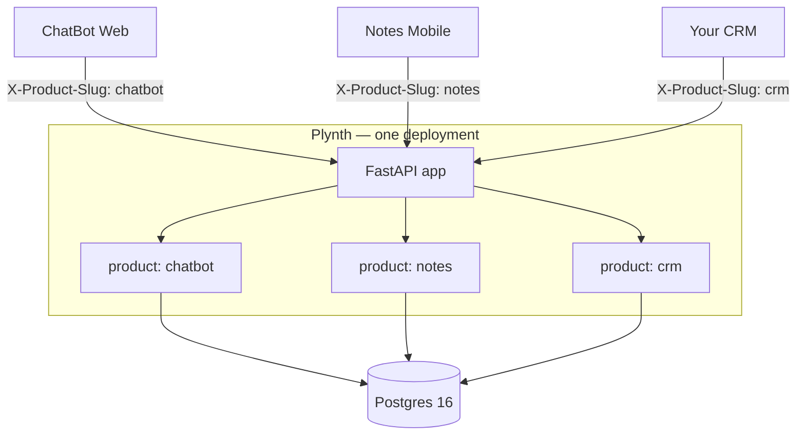

# Why I built Plynth: a multi-product SaaS backend scaffold

The fourth time I sat down to wire up password reset, plan upgrades, and a credit ledger from scratch, I closed the editor and went for a walk. The product was going to be a small AI tool — a weekend of actual feature code — and I was looking at six weeks of plumbing before a user could even sign up and pay me. None of that plumbing was the thing I wanted to ship. So I did what any reasonable person does after the fourth time: I stopped writing the tool and started writing the thing I kept needing instead. That became Plynth.

This post is the why and how. It is opinionated, first-person, and assumes you've shipped enough server code to have your own opinions. If you've rebuilt the same identity-plus-billing core for a third or fourth product and felt the small voice saying *not again*, this is for you.

## The problem

Every SaaS founder ships the same plumbing before they touch a line of product code. Email-password sign-up, JWT issuance and refresh, forgot-password, OAuth, multi-tenancy with strict isolation, RBAC, a plan catalogue, a subscription state machine that actually handles `past_due` and grace-period transitions, a metered credit ledger that doesn't double-charge on retries, a tamper-evident audit log, a background worker for cron and webhooks, a deploy story, and observability that doesn't melt down the first time you grep a log for a tenant. That's roughly six months of work for one competent engineer. Most of it is boring. All of it is security-critical. None of it is the product. Users don't pick you because your refresh-token rotation is correct.

There are good attempts at solving this. Supabase is excellent if you want one product on a hosted backend with Row-Level Security and a generated client. Nhost is a close cousin with a Hasura flavour. PocketBase is a single binary, perfect when you want zero ops and a tiny project. Each solves the problem for a specific shape — one product per deployment, hosted, opinionated about the frontend. They are not what I needed.

What I needed was the plumbing for *several* SaaS products on the same infrastructure. I run a couple of small B2B tools and a B2C app, and I want to run more without standing up a new Postgres, Redis, Caddy, and billing account every time I get an idea. None of the hosted backends I tried let me put two products on one deployment with hard isolation between them. The closest I got was an ad-hoc `app_id` column on a Supabase schema with hand-written RLS policies — which solved nothing because the rest of the platform (auth, billing, audit) knew nothing about it. The choice was rewriting the same plumbing four times or building it once, properly, with multi-product as a first-class concept. I picked the second.

## What "multi-product" means

This is the core differentiator. In Plynth, one deployment hosts many independent SaaS products. Every domain table — users, tenants, plans, subscriptions, credits, audit, idempotency keys, refresh tokens — has `product_id NOT NULL`. Every read and write goes through a repository that auto-applies `WHERE product_id = :pid AND tenant_id = :tid` from a request-scoped ContextVar. There is no path through the API that crosses a product boundary without an explicit `bypass_product()` block, and those blocks are short enough to `grep` for during review.

Concretely: I can run a ChatBot, a Notes app, and a CRM on one FastAPI process, one Postgres, one Redis, one worker pool, one Caddy — and the same email can sign up for all three without conflict. Tenant `acme` in ChatBot has zero overlap with tenant `acme` in Notes. Different rows, different subscriptions, different credit wallets, different audit trail. Adding a fourth product is one admin call:

```bash
curl -X POST http://localhost:8000/api/v1/admin/products \
  -H "X-Platform-Admin-Token: $PLATFORM_ADMIN_TOKEN" \
  -d '{"name": "CRM", "slug": "crm"}'
```

That call seeds system roles (owner / admin / member), and the product is live. No schema change, no new deployment, no new infrastructure.



If the diagram doesn't render in your reader, the ASCII summary is: three clients each send a different `X-Product-Slug` header, all hit the same FastAPI app, and the app routes every query to its product's slice of one shared Postgres.

## How it's built

The stack is intentionally boring: Python 3.12, FastAPI, SQLAlchemy 2.0 async with asyncpg, PostgreSQL 16, Redis 7, arq for background jobs, Alembic for migrations, Pydantic v2, PyJWT, Argon2id. Stripe behind a pluggable billing-provider interface. Runtime image is about 120 MB. The interesting part is the layering, not the stack.

Layers flow strictly downward: `api → services → repositories → models`. Routers are dumb adapters. Services own business logic and the transaction. Repositories own the dual `(product_id, tenant_id)` filter and are the only path to the database. One transaction per HTTP request, opened in `get_db`, committed on clean exit, rolled back on raise. Webhooks and background jobs use a `session_scope()` helper. Everything is async; there is no sync DB call anywhere in `app/`.

A typical authenticated request walks this chain:

1. `RequestContextMiddleware` binds `request_id` to structlog so every log line is correlated.
2. `RateLimitMiddleware` runs a Redis sliding window per IP + path. Fails open on Redis outage (logs a warning) — I'd rather serve traffic than block legitimate users when Redis hiccups.
3. `get_db` opens the transactional session.
4. `resolve_product` reads `X-Product-Slug`, hits a Redis-cached slug→id lookup, sets `current_product_id` in a ContextVar.
5. `get_current_user` validates the JWT, pulls `pid` + `tid`, verifies the header matches the token, optionally consumes `X-Acting-Tenant-Slug` for parent→child act-as (three gates: hierarchy, config, RBAC).
6. `require_permission("resource:action")` evaluates against the effective tenant scope.
7. The handler calls the service, the service calls the repository, the repository auto-applies the dual filter.

Three pieces of real code make this concrete. First, the RBAC wildcard matcher — twelve lines that handle every permission check on the platform (`app/services/rbac.py`):

```python
# app/services/rbac.py
def _matches(granted: str, required: str) -> bool:
    """`*` matches any single segment; full wildcard `*:*` matches everything."""
    g_res, g_act = granted.split(":", 1)
    r_res, r_act = required.split(":", 1)
    return (g_res in ("*", r_res)) and (g_act in ("*", r_act))
```

That single function is why `*:*` (owner), `users:*` (a custom "user manager" role), and `users:read` (member) all compose correctly. Permissions are global `resource:action` codes; roles are per-product; bindings live in `user_roles` with an optional `scope_tenant_id` for "this role only applies when acting in tenant X".

Second, the model mixins — every domain table gets product + tenant scoping for free (`app/models/user.py`):

```python
# app/models/user.py
class User(
    UUIDPKMixin, TimestampMixin, SoftDeleteMixin,
    ProductScopedMixin, TenantScopedMixin, Base
):
    __tablename__ = "users"
    __table_args__ = (
        # Email unique per tenant among non-deleted rows so admins can
        # re-invite an email after soft-delete.
        Index(
            "uq_users_tenant_email_alive",
            "tenant_id", "email",
            unique=True,
            postgresql_where="deleted_at IS NULL",
        ),
    )
    email: Mapped[str] = mapped_column(String(320), nullable=False, index=True)
    password_hash: Mapped[str] = mapped_column(String(255), nullable=False)
    ...
```

The mixins add `product_id` and `tenant_id` columns, the appropriate foreign keys, and the indexes Alembic needs. The model author writes `email`, `password_hash`, and the relationships — the scoping is invisible discipline.

Third, the escape hatches (`app/core/tenant.py`). Cross-product code paths exist — login looks up a user before there's a JWT, webhook handlers learn the product from the subscription row, the platform admin token operates everywhere. Those paths are explicit:

```python
# app/core/tenant.py
@contextmanager
def bypass_product() -> Iterator[None]:
    """Escape hatch for platform-admin tools / webhook lookup
    before the product id is known."""
    token = _bypass_product_var.set(True)
    try:
        yield
    finally:
        _bypass_product_var.reset(token)
```

`grep -rn bypass_product app/` returns a short, known list. That is the review discipline that keeps the multi-product guarantee real instead of aspirational. Every bypass is a code path I have read and understood.

## The interesting design decisions

A few choices are genuinely opinionated and worth surfacing — the ones I have argued with myself about more than once.

**Partial unique indexes for soft-delete.** The naive shape — `UNIQUE (tenant_id, email)` — breaks the moment you soft-delete a user and want to re-invite the same address. I've seen this get botched both ways: the unique constraint blocks re-invite outright, or it gets dropped and you accidentally allow live duplicates. The Postgres answer is a partial unique index: `unique=True` plus `postgresql_where="deleted_at IS NULL"`. Two users can share an email only if at most one is alive. The `User` snippet above is the exact code. Same pattern on tenant slugs and role names.

**An append-only audit log with a per-mutation invariant.** Every state-changing service path writes an `audit_log` row via `audit.record(...)` or the `audit.audit_action(...)` context manager. Rows carry `actor_user_id`, the action (`<resource>.<action>` lowercase snake), a JSONB diff, and `acting_from_tenant_id` when the actor was parent-acting-as-child. This caught a cross-product bug during development I'd never have noticed otherwise: an admin route was missing its product filter on a list query. The first integration test against two seeded products produced an audit row from product A inside product B's tenant. Five-minute fix. Without the per-mutation invariant the row never exists and the bug ships.

**Per-product JSONB `settings` instead of a feature-flag service.** Each `Product` row carries a JSONB `settings` blob — refresh-token TTL, parent→child act-as toggle, Google OAuth auto-provisioning, future per-product webhook signing keys. I considered standing up LaunchDarkly or building a `feature_flags` table and rejected both. JSONB on the product row means config travels with the product, lives in the same backup, ships in the same Alembic migration on rename, and adds no new infrastructure. The honest trade-off: no percentage rollouts or A/B out of the box. Plynth is the platform layer; if a product needs experiments, that's a v0.3+ feature-flag table (on the roadmap) or a real experimentation tool plugged in alongside.

**A platform-admin god-mode token.** `X-Platform-Admin-Token` is a shared secret in env. When a request carries a valid admin token plus `X-Product-Slug`, `get_current_user` returns a transient `User` with `is_platform_admin = True`, and `user_has_permission` short-circuits to `True` — effective `*:*` everywhere. I know how this reads: a god-mode token in env is the kind of thing that gets you on bad-security-examples lists. The honest reason it exists is that ops and support workflows need cross-product reach — bootstrapping a product end-to-end without minting a JWT, an operator helping a customer without an account in their tenant, the Electron admin doing both from one window. The mitigations: the token is per environment (never committed), every action it performs still writes an audit row tagged with the actor, and `tests/integration/test_platform_admin_god_mode.py` asserts the contract. If you don't want it, leave `PLATFORM_ADMIN_TOKEN` unset — every `/admin/*` route returns 403.

## What's NOT in the scaffold (and why)

Sometimes the absence is the design.

- **A frontend for your actual product.** Every frontend stack disagrees with every other; I'd rather get out of the way than ship a Next.js opinion that ages badly. The Electron admin is for managing the platform itself.
- **Email and SMS sending.** Stubbed under `app/providers/notifications.py`. Plug Resend, Postmark, SES, Twilio — a forty-line driver. v0.2 ships a real default.
- **Object storage.** The Storage API contract is spec'd in `docs/ARCHITECTURE.md` § 6.3 (KV + presigned-blob), but the S3 driver isn't in v0.1. Every team has an opinion about S3 vs R2 vs Backblaze; a forty-line driver beats a wrong default.
- **Cross-product SSO.** Each product registration is independent by design — same email in two products mints two identities. SSO is built *on top* when your products are siblings in a suite; it doesn't belong in the layer that defines isolation.
- **Search and analytics.** Keep this layer boring. Bolt them on outside.

## Compared to alternatives

**Supabase** is excellent for one product on a hosted backend with RLS isolation. If you want a generated client, hosted auth, and don't mind a Supabase-flavoured Postgres, pick Supabase — it'll be faster than Plynth for your first product.

**Nhost** is a near-cousin with a Hasura flavour. Same shape, same trade-off.

**PocketBase** is a single Go binary, perfect when you want zero ops and a tiny project. It does not pretend to be multi-product; that's the design.

**DIY (FastAPI / Express).** Correct if your problem is genuinely unique. If you've shipped this plumbing three times, you know the seams; the fourth rebuild is busywork. That's why this scaffold exists.

Pick Plynth if you're shipping multiple SaaS products on shared infrastructure, want full ownership of identity / billing / audit, prefer self-hosting on your own Postgres, and prefer Python.

## Where we are today

v0.1.0 shipped on 2026-05-25. 173+ tests passing against a real Postgres + Redis in roughly seventeen seconds. MIT licensed. Batteries-included Electron admin under `apps/admin-electron/` for managing every product, tenant, user, plan, subscription, credit wallet, and audit row from one window. `docs/ARCHITECTURE.md` is the source of truth, with focused docs for multi-product, multi-tenancy, RBAC, billing, credits, and deploy runbooks for DigitalOcean ($6 droplet + Caddy + Backblaze B2 backups) and Fly.io (Neon + Upstash). OpenAPI 3.1 committed at `docs/openapi.json`; docs site at [shubhamkatta.github.io/plynth](https://shubhamkatta.github.io/plynth).

A small set of `good first issue` tasks is open — onboarding polish, regression coverage for edge cases that exist in code but aren't yet asserted, doc patches, and a `make new-product <slug>` convenience target. List at [github.com/shubhamkatta/plynth/labels/good first issue](https://github.com/shubhamkatta/plynth/labels/good%20first%20issue).

## What's coming next

v0.2 is about making Plynth genuinely complete for the read-write workloads people build on top. Most of these already have a contract in the architecture doc — the work is the implementation.

- **Implement the Jobs API** (`architecture.md` § 6.2). Typed handler registry, queue + status endpoints, arq worker integration, the four `jobs:*` RBAC codes are already seeded. This unlocks long-running product work — PDF rendering, batch imports, scheduled exports — without each product reinventing the queue.
- **Implement the Storage API** (`architecture.md` § 6.3). Per-product `storage_kv` and `storage_blob_uploads`, scoped routes, the three `storage:*` permission codes. Useful as a Postgres-backed KV even without an S3 driver; the blob driver follows in v0.3.
- **Wire a real notification provider** behind `app/providers/notifications.py` so forgot-password emails actually arrive (Resend or Postmark).
- **Per-product webhooks endpoint** — admins register HMAC-signed delivery URLs against a product; the platform fans out subscription, user, and credit events with retry and backoff.
- **`plynth` CLI** — terminal-first ergonomics around the things that are curl-and-JWT today.
- **Frontend starter under `examples/`** — a Next.js app talking to Plynth via the documented REST API.
- **Flip mypy back to gating in CI** — finish the type-hygiene backlog.

The `help wanted` label tags the mid-effort items that have a designed contract and are waiting on someone to implement them — the Jobs API and Storage API among them. If you've got a half-day and want to land a chunk of work that will ship in v0.2, those are the issues to grab.

## Try it

```bash
git clone https://github.com/shubhamkatta/plynth.git
cd plynth
cp .env.example .env
make up && make migrate && make seed
open http://localhost:8000/docs
```

Five minutes from zero to a running multi-product backend with seeded plans, an admin user (`admin@example.com` / `ChangeMeNow123!` — change immediately), and a trial subscription. Default product slug is `platform`; send `X-Product-Slug: platform` on every public call. Docs: [shubhamkatta.github.io/plynth](https://shubhamkatta.github.io/plynth). Issues tagged [`good first issue`](https://github.com/shubhamkatta/plynth/labels/good%20first%20issue) for first-time contributors.

If you build something on top, let me know — open a thread in [Discussions](https://github.com/shubhamkatta/plynth/discussions). I'd much rather hear "I tried this and it broke on X" than have you bounce off in silence.

---

*MIT licensed. Built by [@shubhamkatta](https://github.com/shubhamkatta). Comments, disagreements, "you should have used X" — drop them below or in the GitHub issues.*
